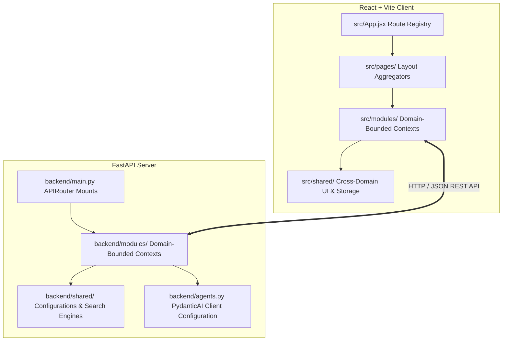
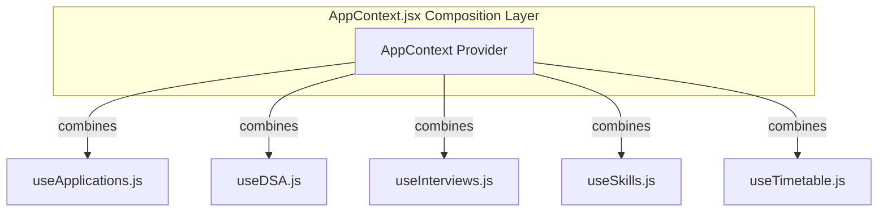
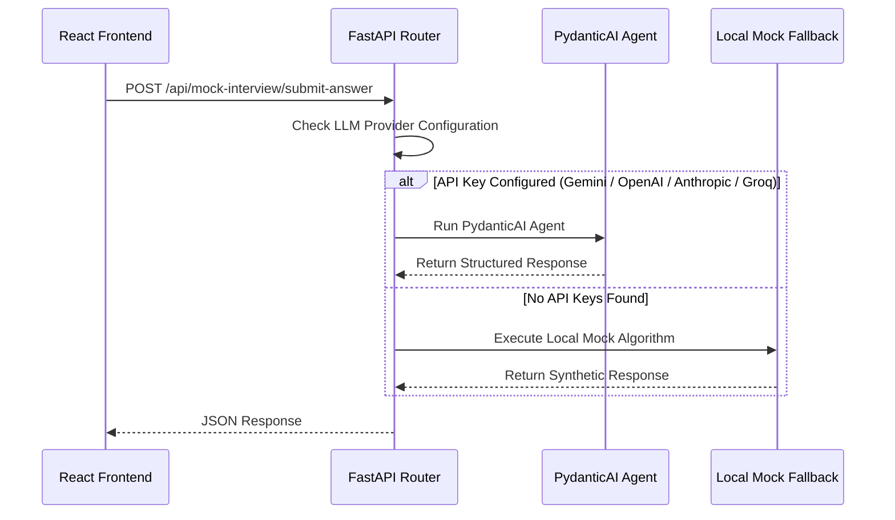

# 🏗️ Architecture Design: CareerOS / Job Hunt OS

Welcome to the **CareerOS Architecture Documentation**. This document provides an in-depth breakdown of the design patterns, methodologies, and architectural choices that govern the CareerOS project, enabling it to scale for hundreds of open-source contributors.

---

## 1. Design Philosophy & Philosophy of Refactoring

CareerOS is structured around two core principles:
1. **Developer Autonomy (Conflict-Free Contribution)**: Open-source projects often stall because developers run into merge conflicts when touching global contexts, shared page files, or monolithic routers.
2. **Domain-Driven Design (DDD) with Bounded Contexts**: Every major business capability (e.g. applications, interviews, DSA tracker) is packaged into its own folder (a **module**) that contains all components, state hooks, storage adapters, APIs, and models needed to function.

### Why This Architecture?
- **Decoupled Architecture**: Developers modifying the Mock Interview UI or its scoring agents only edit files under `src/modules/interviews/` or `backend/modules/interview/`. There is zero overlap with `src/modules/dsa/` or `backend/modules/dsa/`.
- **Low Orchestrator Footprint**: The global context (`src/context/AppContext.jsx`) acts purely as a thin composition layer (or proxy) that aggregates individual domain hooks. Adding a new module does not require rewriting the state engine.
- **Resilient AI Mock Fallbacks**: Because api keys are optional, the architecture segregates the AI agents from the routes. If an LLM call fails or no API key is specified, a type-safe mock response is served instantly to maintain a working UI.

---

## 2. System Architecture Overview

CareerOS uses a decoupled full-stack architecture with a React-Vite client and a FastAPI ASGI server.

---

## 3. Domain Bounded Contexts (Vertical Slices)

Every business unit is split into a **Vertical Slice**. Below is the mapping of functional domains across both the Frontend and the Backend:

| Feature / Domain | Frontend Module Directory | Backend Module Directory |
| :--- | :--- | :--- |
| **Job Applications** | `src/modules/applications/` | `backend/modules/copilot/` (Shared parser) |
| **Mock Interviews** | `src/modules/interviews/` | `backend/modules/interview/` |
| **Networking & Contacts** | `src/modules/networking/` | `backend/modules/networking/` |
| **DSA & LeetCode Tracker**| `src/modules/dsa/` | `backend/modules/dsa/` |
| **Skill Progress Matrix** | `src/modules/skills/` | N/A (Local persistence) |
| **Resume & Cover Letter** | `src/modules/resume/` | `backend/modules/copilot/` |
| **Timetable Planner** | `src/modules/timetable/` | N/A (Local persistence) |
| **Daily Missions & Streaks**| `src/modules/missions/` | N/A (Local persistence) |
| **Achievements & Badges** | `src/modules/achievements/` | N/A (Local persistence) |
| **User Settings** | `src/modules/settings/` | N/A (Local persistence) |
| **Performance Insights** | `src/pages/Analytics.jsx` | `backend/modules/analytics/` |

---

## 4. Frontend Architecture & State Management

The frontend uses React 19. The styling uses vanilla CSS coupled with custom design tokens for rich dark-mode visuals.

### 4.1 State Hook Delegation Pattern
Instead of storing state in a monolithic global state container, each domain module handles its own state logic using custom React hooks:

To maintain backward compatibility with older components, `AppContext.jsx` imports these individual hooks and exposes them via `useApp()`. However, **new pages should directly consume their module hook** (e.g. `const { slots, addSlot } = useTimetable()`) to bypass global state recalculations and avoid circular dependency warnings.

### 4.2 UI Design Kit (`src/shared/ui/`)
All pages are visually unified through components located in `src/shared/ui/`:
- `Modal`: Handles focal transitions, click-outside-to-close, and escape keys.
- `Button`: Encapsulates interactive hover, transitions, states (primary, secondary, danger, ghost).
- `KpiCard`: Premium visual widget presenting quantitative indices with colored sub-labels.
- `EmptyState`: Centered graphic representation for blank states.

---

## 5. Backend Architecture & AI Pipelines

The backend is built with FastAPI. It leverages **PydanticAI** to construct type-safe LLM processing graphs.

### 5.1 Request Flow with Mock Fallbacks
To allow developers to code and test offline without API keys, every agent endpoint implements a fallback mechanism:

### 5.2 Shared Backend Layer
- `backend/shared/llm.py`: Configures global provider parameters and manages credential rotation.
- `backend/shared/search.py`: Implements a fast in-memory TF-IDF index coupled with **Reciprocal Rank Fusion (RRF)** to perform multi-field search queries.

---

## 6. Storage Strategy

1. **Client Storage**: Persistent browser state uses `localStorage` (via `src/shared/storage/localStorage.js`).
2. **Backup & Restore**: Profile configs, application records, and achievements are exportable as JSON via the `Settings` page.
3. **Backend Memory**: Mock interview session states reside in-memory (`InterviewManager.sessions` map). This keeps the service stateless and allows horizontal scaling behind routers.

---

## 7. Extensions and Future Scalability

### Architectural Strictness Rules
- **No Direct Module Imports**: Files in `src/modules/dsa/` cannot import helper functions from `src/modules/applications/`. Use `src/shared/` for shared utilities.
- **Export Indices**: Every module must have an `index.js` file exposing only its public interface (e.g. its main page component, hooks, and constants). Contributors must not reach inside a module to import sub-components.
- **Mock Implementation Priority**: Any new agent added must have a correspond mock function in `backend/modules/<name>/mock.py` or equivalent fallback files.
